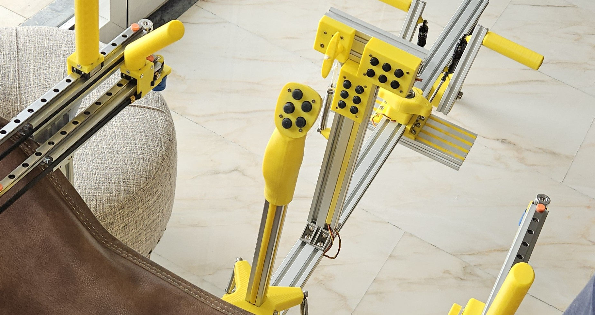
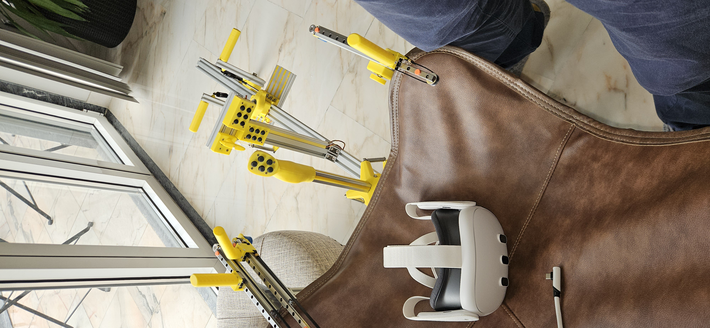
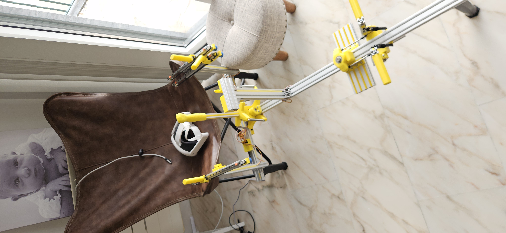
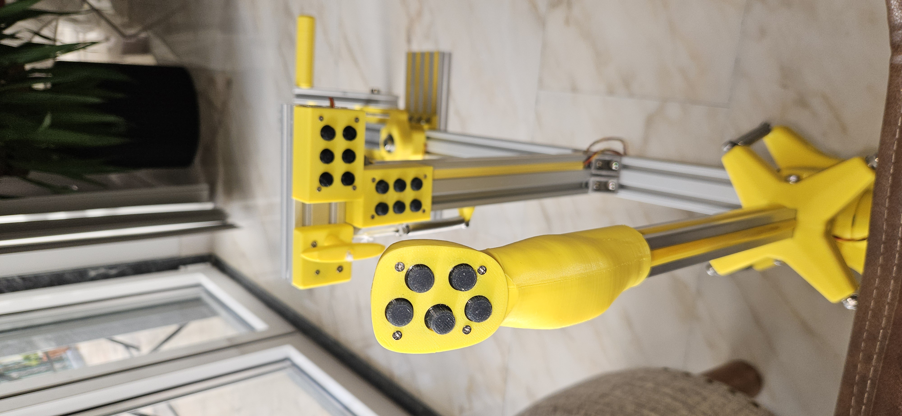
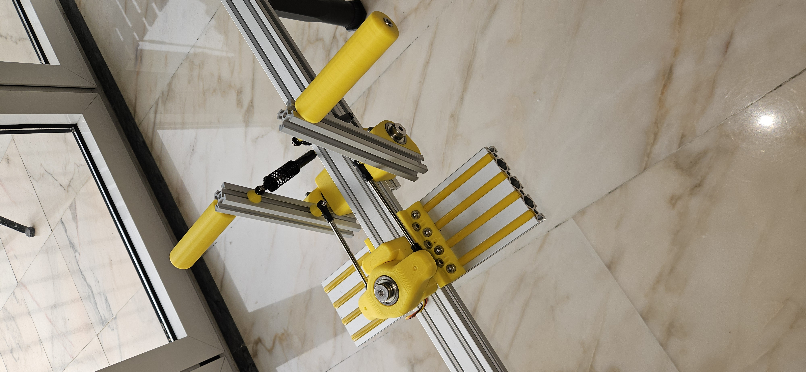
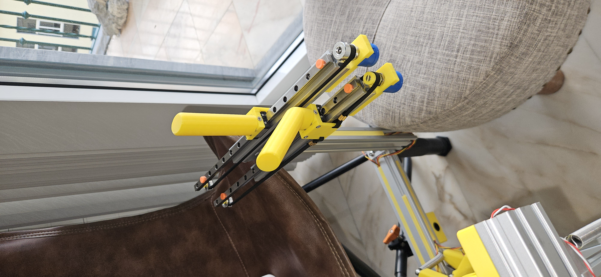
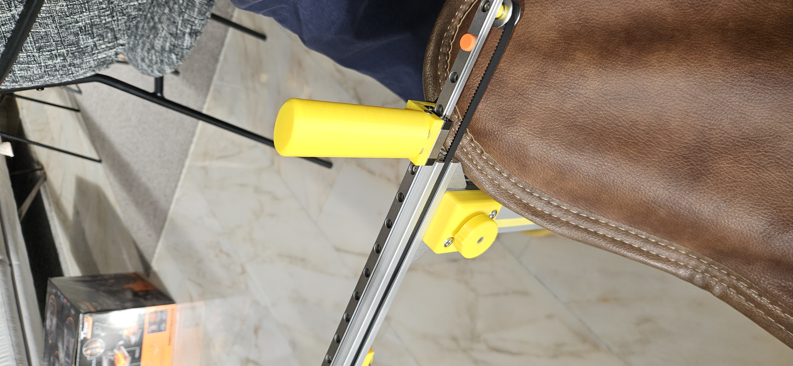

# glider-sim

A glider flight simulation cockpit project. Includes 3D printable STL parts, bill of materials, controller code, and assembly instructions.

> [!NOTE]
> This page is still under construction and being updated with more information.

This project was designed to be used with the **Condor 3** glider flight simulator.

## Bill of Materials (BOM)

> [!NOTE]
> The AliExpress links do not have the correct product options pre-selected. Please make sure to select the correct options according to the item description.

### Frame

| Quantity | Type | Size | Length | Description | Shop |
|----------|------|------|--------|-------------|------|
| 1 | Aluminium Profile | 4040 | 900 | main frame | |
| 1 | Aluminium Profile | 4040 | 600 | side frame | |
| 3 | Aluminium Profile | 2040 | 300 | vertial arms | |
| 1 | Aluminium Profile | 2040 | 120 | front panel | |
| 3 | Aluminium Profile | 2020 | 200 | sliders | |
| 1 | Aluminium Profile | 2020 | 300 | joystick | |
| 2 | Aluminium Profile | 2020 | 150 | pedals | |
| 1 | Aluminium Profile | 2080 | 300 | feet rest | |
| 14 | Profile T connectors | 2020 |  | Profile Connector Corner Bracket | [Link](https://pt.aliexpress.com/item/1005005600396191.html) |
| 2 | Profile 90 deg connector | 2020-2 L40 |  | L connector 2020-2 L40 (sliders base) | [Link](https://pt.aliexpress.com/item/1005004312946435.html) |
| 4 | Profile 90 deg connector | 2020-2 L20 |  | L connector 2020-2 L20 (sliders base) | [Link](https://pt.aliexpress.com/item/1005004312946435.html) |
| 1 | Profile 90 deg connector | 2040B-6 |  | L connector 2040B-6 (secondary slider) | [Link](https://pt.aliexpress.com/item/1005004312946435.html) |
| 3 | Telescopic Feet |  | 16.5CM-28.5CM | Telescopic Feet 16.5CM-28.5CM | [Link](https://pt.aliexpress.com/item/1005007648713847.html) |
| 1 | Profile Slot Cover | 6mm (20 series) |  | Plastic Profile Slot Cover 20 Series | [Link](https://pt.aliexpress.com/item/1005005475646170.html) |

### Joystick Base

| Quantity | Type | Size | Length | Description | Shop |
|----------|------|------|--------|-------------|------|
| 4 | Bearings | 10x26x8mm |  | Bearings 10x26x8mm (Inside diameter x Outside diameter x Width) | [Link](https://www.aliexpress.com/item/1005007668446060.html) |
| 2 | Shoulder Bolts | D10M8 | 20 | M8x20 Shoulder Bolts (10mm shoulder, 8mm thread) | [Link](https://pt.aliexpress.com/item/1005008615324350.html) |
| 2 | Shoulder Bolts | D10M8 | 10 | M8x10 Shoulder Bolts (10mm shoulder, 8mm thread) | [Link](https://pt.aliexpress.com/item/1005008615324350.html) |
| 8 | Bolts (Option A) | M5 | 10 | M5x10 Bolts to fix springs | [Link](https://pt.aliexpress.com/item/32969034133.html) |
| 5 | Bolts | M5 | 14 | M5x14 Bolts | [Link](https://pt.aliexpress.com/item/32969034133.html) |
| 10 | Bolts | M5 | 20 | M5x20 Bolts | [Link](https://pt.aliexpress.com/item/32969034133.html) |
| 15 | T-slot Nuts | M5 |  | M5 T-slot Nuts | [Link](https://pt.aliexpress.com/item/1005007383347166.html) |
| 2 | Magnets | 8x8x8 |  | 8mm cube magnets | [Link](https://pt.aliexpress.com/item/1005009224525065.html) |
| 2 | Hall Effect Sensor |  |  | Hall Effect Sensor SS496A1 | [Link](https://pt.aliexpress.com/item/1005008652267102.htm) |
| 4 | Option A: Springs |  | 75 | 75x10x1.25mm Springs (Length x Outside Diameter x Wire Diameter) | [Link](https://pt.aliexpress.com/item/1005003939622047.html) |
| 4 | Option B: Oil shock absorber |  | 110 | oil shock absorber 110mm | [Link](https://pt.aliexpress.com/item/1005005791841993.html) |
| 4 | Option B: M3-M5 Adapter | M3-M5 | 10 | M3-M5  10mm Thread Adapter Screw Nuts | [Link](https://pt.aliexpress.com/item/1005007436046737.html) |

### Joystick Controller

| Quantity | Type | Size | Length | Description | Shop |
|----------|------|------|--------|-------------|------|
| 4 | M2-M4 Adapter | M2-M4 | 8 | M2-M4  8mm Thread Adapter Screw Nuts | [Link](https://pt.aliexpress.com/item/1005007436046737.html) |
| 4 | Flat Bolts | M2 | 10 | M2x10 Flat Countersunk Head Bolt  | [Link](https://pt.aliexpress.com/item/1005007148309873.html) |
| 1 | Controller ESP32-C3 |  |  | ESP32-C3 Supermini | [Link](https://pt.aliexpress.com/item/1005008212278653.html) |
| 4 | Push Button Switch | 6x6x4.1 |  | Push Button Switch  4x4x4.1 DIP (4x4x4.3 is also ok) | [Link](https://pt.aliexpress.com/item/1005001629177989.html) |
| 1 | 5-way Switch | 10x10x10 |  | 5-way tactile switch 10x10x10 DIP | [Link](https://pt.aliexpress.com/item/4000681560472.html) |
| 1 | Liquid Rubber |  |  | Silicon Liquid Rubber (buttons) | [Link](https://pt.aliexpress.com/item/1005008302473853.html) |
| 1 | Black Pigment |  |  | Solid Color Black Pigment (buttons color) | [Link](https://pt.aliexpress.com/item/1005005830256537.html) |

### Rudder Pedals

| Quantity | Type | Size | Length | Description | Shop |
|----------|------|------|--------|-------------|------|
| 3 | Shoulder Bolts | D10M8 | 30 | M8x30 Shoulder Bolts | [Link](https://pt.aliexpress.com/item/1005008615324350.html) |
| 6 | Bearings | 10x26x8mm |  | Bearings 10x26x8mm (Inside diameter x Outside diameter x Width) | [Link](https://www.aliexpress.com/item/1005007668446060.html) |
| 14 | Bolts | M5 | 10 | M5x10mm Bolts (Feet Rest) | [Link](https://pt.aliexpress.com/item/32969034133.html) |
| 4 | Bolts | M5 | 14 | M5x14mm Bolts (Option A - Springs) | [Link](https://pt.aliexpress.com/item/32969034133.html) |
| 16 | Bolts | M5 | 20 | M5x20mm Bolts | [Link](https://pt.aliexpress.com/item/32969034133.html) |
| 32 | T-slot Nuts | M5 |  | M5 T-slot Nuts | [Link](https://pt.aliexpress.com/item/1005007383347166.html) |
| 6 | T-slot Nuts | M3 |  | M3 T-slot Nuts | [Link](https://pt.aliexpress.com/item/1005007383347166.html) |
| 2 | Bolts | M5 | 100 | M5x100mm Bolts | [Link](https://pt.aliexpress.com/item/32969034133.html) |
| 2 | Link Rods | M3 | 110 | Stainless steel link rods with rod ends 110mm | [Link](https://pt.aliexpress.com/item/1005007792947401.html) |
| 2 | M3-M5 Adapter | M3-M5 | 10 | M3-M5  10mm Thread Adapter Screw Nuts (Link rod) | [Link](https://pt.aliexpress.com/item/1005007436046737.html) |
| 6 | Bolts | M3 | 20 | M3x18mm Bolts (link spacer/shock absorber) | [Link](https://pt.aliexpress.com/item/1005009149226092.html) |
| 2 | Bolts | M3 | 16 | M3x16mm Bolts (Shock absorber) | [Link](https://pt.aliexpress.com/item/1005009149226092.html) |
| 2 | Magnets | 8x8x8 |  | 8mm cube magnets | [Link](https://pt.aliexpress.com/item/1005009224525065.html) |
| 1 | Hall Effect Sensor |  |  | Hall Effect Sensor SS496A1 | [Link](https://pt.aliexpress.com/item/1005008652267102.htm) |
| 2 | Option A: Springs |  | 75 | 75x10x1.25mm Springs (Length x Outside Diameter x Wire Diameter) | [Link](https://pt.aliexpress.com/item/1005003939622047.html) |
| 2 | Option B: Oil shock absorber |  | 110 | oil shock absorber 110mm | [Link](https://pt.aliexpress.com/item/4000245803426.html) |

### Sliders (Air-breaks, flaps and gear)

| Quantity | Type | Size | Length | Description | Shop |
|----------|------|------|--------|-------------|------|
| 3 | Linear Guide Rail | MGN9C | 300 | Linear Guide Rail MGN9C, 300mm | [Link](https://pt.aliexpress.com/item/1000007480470.html) |
| 3 | Potentiometer | 10k Ohm |  | 10‑turn rotary potentiometer 10k Ohm | [Link](https://pt.aliexpress.com/item/32858999042.html) |
| 3 | GT2 Idler | 20T W6 B5 |  | GT2  Idler 20 Tooth Width 6mm Bore 5mm | [Link](https://pt.aliexpress.com/item/1005003291106065.html) |
| 1 | GT2 belt | 6mm | 2m | GT2-6mm belt 2m | [Link](https://pt.aliexpress.com/item/1005010509278792.html) |
| 6 | GT2 Belt Clamp | 6mm |  | GT2 Belt Clamp | [Link](https://pt.aliexpress.com/item/1005006646819498.html) |
| 6 | Bolts | M5 | 8 | M5x8mm Bolts (potentiometer arm) | [Link](https://pt.aliexpress.com/item/32969034133.html) |
| 6 | Flat Bolts | M3 | 8 | M3x8 Flat Countersunk Head Bolt  (fix linear guided rail to 2020 profile) | [Link](https://pt.aliexpress.com/item/1005007148309873.html) |
| 3 | Bolts | M3 | 16 | M3x16  Bolt  (fix GT2 Idler with Pulley Spacer) | [Link](https://pt.aliexpress.com/item/1005007148309873.html) |
| 6 | Heat Insert Nut | M3 | 5cm | Heat Insert Nut M3x5x4 (Inside diameter x length x outside diameter) for handle | [Link](https://pt.aliexpress.com/item/1005006351445007.htm) |
| 6 | Heat Insert Nut | M3 | 4cm | Heat Insert Nut M3x4x4 (Inside diameter x length x outside diameter) for handle base | [Link](https://pt.aliexpress.com/item/1005006351445007.htm) |
| 12 | Flat Bolts | M3 | 12 | M3x12 Flat Countersunk Head Bolt  (fix base to linear guided rail carriage) | [Link](https://pt.aliexpress.com/item/1005007148309873.html) |
| 12 | Flat Bolts | M3 | 8 | M3x8 Flat Countersunk Head Bolt  (fix handle & rubber belt link to base) | [Link](https://pt.aliexpress.com/item/1005007148309873.html) |
| 6 | T-slot Nuts | M5 |  | M5 T-slot Nuts | [Link](https://pt.aliexpress.com/item/1005007383347166.html) |
| 9 | T-slot Nuts | M3 |  | M3 T-slot Nuts | [Link](https://pt.aliexpress.com/item/1005007383347166.html) |

### Chair holder

| Quantity | Type | Size | Length | Description | Shop |
|----------|------|------|--------|-------------|------|
| 2 | Crab Clamp |  |  | Crab Clamp with 3/8" hole | [Link](https://pt.aliexpress.com/item/1005006408880169.html) |
| 2 | Bolt | 3/8" | 2" | UNC hex socket cap screw 3/8-16 Length: 2" | [Link](https://pt.aliexpress.com/item/1005008374821420.htm) |
| 8 | Bolts | M5 | 14 | M5x14 Bolts | [Link](https://pt.aliexpress.com/item/32969034133.html) |
| 8 | T-slot Nuts | M5 |  | M5 T-slot Nuts | [Link](https://pt.aliexpress.com/item/1005007383347166.html) |

> [!WARNING]
> This BOM is still under development. The following sections are missing:
> - 6 Button Case
> - Trim
> - Release
> - Controller Box
## Credits

The joystick handle design was adapted from the [OpenVario Remote Stick project](https://www.openvario.org/doku.php?id=projects:remote_00:top), created by the OpenVario community.

The joystick and rudder pedals were adapted from the [Flight-Simulator-Joystick](https://github.com/TomStanton/Flight-Simulator-Joystick) project, developed by Tom Stanton.

## Photos

### Front View

### Back View

### Control Stick

### Rudder Pedals

### Flaps & Airbrakes

### Gear & Trim

