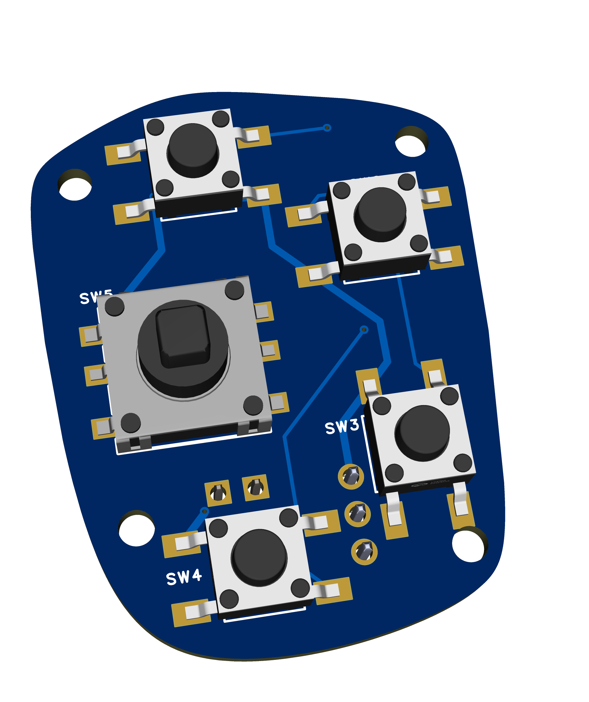

# glider-sim

A glider flight simulation cockpit project. Includes 3D printable STL parts, bill of materials, and controller code.
This project was designed to be used with the **Condor 3** glider flight simulator.

---

If you enjoy this project and want to say thanks, you can **buy me a beer** via [GitHub Sponsors](https://github.com/sponsors/Fsarmento). 🍺

---

> [!NOTE]
> If you have any questions about this project, please use the [Discussions](https://github.com/Fsarmento/glider-sim/discussions) section. I'll try to answer them.

## Introduction

This project uses aluminum profiles for the structure, 3D-printed parts, three PCBs to simplify electronic assembly, and accessories that can be easily purchased online from AliExpress or Banggood.
To assemble this cockpit, you will need a 3D printer and a soldering iron for electronics.

All 3D drawings are located in the `/stl` folder, organized into subfolders to make it easier to identify which module they belong to. I used PLA with 20% infill for all parts.

The links in the BOM list often point to sets, such as screw kits, where a single set contains the materials needed for multiple BOM lines.

The main controller uses an Arduino Pro Micro and is detected by the PC as a standard joystick. The stick buttons and each 6-button box use ESP32-C3 Supermini controllers. To simplify assembly without taking up much space, I designed 3 PCBs and provide the GERBER files in ZIP format in the `/PCB` folder. Nowadays, it is so easy and affordable to have PCBs manufactured that it makes sense to have boards custom-sized to your needs. To have the boards produced, simply go to the JLCPCB website [https://cart.jlcpcb.com/quote](https://cart.jlcpcb.com/quote) and upload the zip file. You do not need to change any of the default options on the site. With the cheapest shipping method, the production and shipping of each PCB costs around €7. In the case of the stick buttons, as space is very limited, I could only fit everything using SMD (surface-mount) buttons, which are harder to solder. For this reason, I suggest using the PCBA service to assemble the front of the PCB already with the buttons supplied by JLCPCB. To do this, at the bottom of the JLCPCB page [https://cart.jlcpcb.com/quote](https://cart.jlcpcb.com/quote), simply enable the "PCB Assembly" option and on the next page upload the BOM and CPL files provided inside the `/PCB` folder.

The code to upload to each controller is located inside the `/scripts` folder. You can use the Arduino IDE to upload the code to each controller.

I hope you enjoy assembling the cockpit and "flying" as much as I did!

## Bill of Materials (BOM)

> [!IMPORTANT]
> The AliExpress links do not have the correct product options pre-selected. Please make sure to select the correct options according to the item description.

### Frame

| Quantity | Type | Size | Length | Description | Shop |
|----------|------|------|--------|-------------|------|
| 1 | Aluminium Profile | 4040 | 900 | main frame | |
| 1 | Aluminium Profile | 4040 | 600 | side frame | |
| 3 | Aluminium Profile | 2040 | 300 | vertial arms | |
| 1 | Aluminium Profile | 2040 | 120 | front panel | |
| 3 | Aluminium Profile | 2020 | 200 | sliders | |
| 1 | Aluminium Profile | 2020 | 300 | joystick | |
| 2 | Aluminium Profile | 2020 | 150 | pedals | |
| 1 | Aluminium Profile | 2080 | 300 | feet rest | |
| 14 | Profile T connectors | 2020 |  | Profile Connector Corner Bracket set | [Link](https://s.click.aliexpress.com/e/_c4St6Xq9) |
| 2 | Profile 90 deg connector | 2020-2 L40 |  | L connector 2020-2 L40 (sliders base) | [Link](https://s.click.aliexpress.com/e/_c4KEbXQH) |
| 4 | Profile 90 deg connector | 2020-2 L20 |  | L connector 2020-2 L20 (sliders base) | [Link](https://s.click.aliexpress.com/e/_c4KEbXQH) |
| 1 | Profile 90 deg connector | 2040B-6 |  | L connector 2040B-6 (secondary slider) | [Link](https://s.click.aliexpress.com/e/_c4KEbXQH) |
| 3 | Telescopic Feet |  | 16.5CM-28.5CM | Telescopic Feet 16.5CM-28.5CM | [Link](https://s.click.aliexpress.com/e/_c4MEUecl) |
| 1 | Profile Slot Cover | 6mm (20 series) |  | Plastic Profile Slot Cover 20 Series | [Link](https://s.click.aliexpress.com/e/_c3PiaaX3) |

### Joystick base

| Quantity | Type | Size | Length | Description | Shop |
|----------|------|------|--------|-------------|------|
| 4 | Bearings | 10x26x8mm |  | Bearings 10x26x8mm (Inside diameter x Outside diameter x Width) | [Link](https://www.aliexpress.com/item/1005007668446060.html) |
| 2 | Shoulder Bolts | D10M8 | 20 | M8x20 Shoulder Bolts (10mm shoulder, 8mm thread) | [Link](https://s.click.aliexpress.com/e/_c3ETZkxx) |
| 2 | Shoulder Bolts | D10M8 | 10 | M8x10 Shoulder Bolts (10mm shoulder, 8mm thread) | [Link](https://s.click.aliexpress.com/e/_c3ETZkxx) |
| 8 | Bolts (Option A) | M5 | 10 | M5x10 Bolts DIN912 to fix springs | [Link](https://s.click.aliexpress.com/e/_c3y9Zvm3) |
| 5 | Bolts | M5 | 14 | M5x14 Bolts DIN912 | [Link](https://s.click.aliexpress.com/e/_c3y9Zvm3) |
| 10 | Bolts | M5 | 20 | M5x20 Bolts DIN912 | [Link](https://s.click.aliexpress.com/e/_c3y9Zvm3) |
| 15 | T-slot Nuts | M5 |  | M5 T-slot Nuts | [Link](https://s.click.aliexpress.com/e/_c3ZBusUH) |
| 2 | Magnets | 8x8x8 |  | 8mm cube magnets | [Link](https://s.click.aliexpress.com/e/_c4EhHqoz) |
| 2 | Hall Effect Sensor |  |  | Hall Effect Sensor SS496A1 | [Link](https://s.click.aliexpress.com/e/_c4PvMVrB) |
| 4 | Option A: Springs |  | 75 | 75x10x1.25mm Springs (Length x Outside Diameter x Wire Diameter) | [Link](https://s.click.aliexpress.com/e/_c2zo177f) |
| 4 | Option B: Oil shock absorber |  | 110 | oil shock absorber 110mm | [Link](https://s.click.aliexpress.com/e/_c3EF2605) |
| 4 | Option B: M3-M5 Adapter | M3-M5 | 10 | M3-M5  10mm Thread Adapter Screw Nuts | [Link](https://pt.aliexpress.com/item/1005007436046737.html) |

### Joystick controller

| Quantity | Type | Size | Length | Description | Shop |
|----------|------|------|--------|-------------|------|
| 4 | M2-M4 Adapter | M2-M4 | 8 | M2-M4  8mm Thread Adapter Screw Nuts | [Link](https://pt.aliexpress.com/item/1005007436046737.html) |
| 4 | Flat Bolts | M2 | 10 | M2x10 Flat Countersunk Head Bolt  | [Link](https://s.click.aliexpress.com/e/_c368gRLJ) |
| 1 | Controller ESP32-C3 |  |  | ESP32-C3 Supermini | [Link](https://s.click.aliexpress.com/e/_c2RvZ7EN) |
| 4 | Push Button Switch | 6x6x4.1 |  | Push Button Switch  4x4x4.1 DIP (4x4x4.3 is also ok) | [Link](https://s.click.aliexpress.com/e/_c4dK0HMX) |
| 1 | 5-way Switch | 10x10x10 |  | 5-way tactile switch 10x10x10 DIP | [Link](https://s.click.aliexpress.com/e/_c458W5dT) |
| 1 | Liquid Rubber |  |  | Silicon Liquid Rubber (buttons) | [Link](https://s.click.aliexpress.com/e/_c4Xd5cIh) |
| 1 | Black Pigment |  |  | Solid Color Black Pigment (buttons color) | [Link](https://pt.aliexpress.com/item/1005005830256537.html) |

### Rudder pedals:

| Quantity | Type | Size | Length | Description | Shop |
|----------|------|------|--------|-------------|------|
| 3 | Shoulder Bolts | D10M8 | 30 | M8x30 Shoulder Bolts | [Link](https://s.click.aliexpress.com/e/_c3ETZkxx) |
| 6 | Bearings | 10x26x8mm |  | Bearings 10x26x8mm (Inside diameter x Outside diameter x Width) | [Link](https://www.aliexpress.com/item/1005007668446060.html) |
| 14 | Bolts | M5 | 10 | M5x10mm Bolts DIN912 (Feet Rest) | [Link](https://s.click.aliexpress.com/e/_c3y9Zvm3) |
| 4 | Bolts | M5 | 14 | M5x14mm Bolts DIN912 (Option A - Springs) | [Link](https://s.click.aliexpress.com/e/_c3y9Zvm3) |
| 16 | Bolts | M5 | 20 | M5x20mm Bolts DIN912 | [Link](https://s.click.aliexpress.com/e/_c3y9Zvm3) |
| 32 | T-slot Nuts | M5 |  | M5 T-slot Nuts | [Link](https://s.click.aliexpress.com/e/_c3ZBusUH) |
| 6 | T-slot Nuts | M3 |  | M3 T-slot Nuts | [Link](https://s.click.aliexpress.com/e/_c3ZBusUH) |
| 2 | Bolts | M5 | 100 | M5x100mm Bolts DIN912 | [Link](https://s.click.aliexpress.com/e/_c3y9Zvm3) |
| 2 | Link Rods | M3 | 110 | Stainless steel link rods with rod ends 110mm | [Link](https://s.click.aliexpress.com/e/_c3kGKZzb) |
| 2 | M3-M5 Adapter | M3-M5 | 10 | M3-M5  10mm Thread Adapter Screw Nuts (Link rod) | [Link](https://pt.aliexpress.com/item/1005007436046737.html) |
| 6 | Bolts | M3 | 20 | M3x18mm Bolts (link spacer/shock absorber) | [Link](https://s.click.aliexpress.com/e/_c3PQiYDP) |
| 2 | Bolts | M3 | 16 | M3x16mm Bolts (Shock absorber) | [Link](https://s.click.aliexpress.com/e/_c3PQiYDP) |
| 2 | Magnets | 8x8x8 |  | 8mm cube magnets | [Link](https://s.click.aliexpress.com/e/_c4EhHqoz) |
| 1 | Hall Effect Sensor |  |  | Hall Effect Sensor SS496A1 | [Link](https://s.click.aliexpress.com/e/_c4PvMVrB) |
| 2 | Option A: Springs |  | 75 | 75x10x1.25mm Springs (Length x Outside Diameter x Wire Diameter) | [Link](https://s.click.aliexpress.com/e/_c2zo177f) |
| 2 | Option B: Oil shock absorber |  | 110 | oil shock absorber 110mm | [Link](https://s.click.aliexpress.com/e/_c3B7cY09) |

### Sliders (up to 3 sets: airbreaks, flaps and gear)

| Quantity | Type | Size | Length | Description | Shop |
|----------|------|------|--------|-------------|------|
| 1 | Linear Guide Rail | MGN9C | 300 | Linear Guide Rail MGN9C, 300mm | [Link](https://s.click.aliexpress.com/e/_c4Eh7oYL) |
| 1 | Potentiometer | 10k Ohm |  | 10‑turn rotary potentiometer 10k Ohm | [Link](https://s.click.aliexpress.com/e/_c3l51dZt) |
| 1 | GT2 Idler | 20T W6 B5 |  | GT2  Idler 20 Tooth Width 6mm Bore 5mm | [Link](https://pt.aliexpress.com/item/1005003291106065.html) |
| 1 | GT2 belt | 6mm | 2m | GT2-6mm belt 2m (1 for 3 sets) | [Link](https://s.click.aliexpress.com/e/_c3UojoNn) |
| 2 | GT2 Belt Clamp | 6mm |  | GT2 Belt Clamp | [Link](https://s.click.aliexpress.com/e/_c39U7WKh) |
| 2 | Bolts | M5 | 8 | M5x8mm Bolts DIN912 (potentiometer arm) | [Link](https://s.click.aliexpress.com/e/_c3y9Zvm3) |
| 2 | Flat Bolts | M3 | 8 | M3x8 Flat Countersunk Head Bolt  (fix linear guided rail to 2020 profile) | [Link](https://s.click.aliexpress.com/e/_c368gRLJ) |
| 1 | Bolts | M3 | 16 | M3x16  Bolt  (fix GT2 Idler with Pulley Spacer) | [Link](https://s.click.aliexpress.com/e/_c368gRLJ) |
| 2 | Heat Insert Nut | M3 | 5 | Heat Insert Nut M3x5x4 (Inside diameter x length x outside diameter) for handle | [Link](https://s.click.aliexpress.com/e/_c4eRekuz) |
| 2 | Heat Insert Nut | M3 | 4 | Heat Insert Nut M3x4x4 (Inside diameter x length x outside diameter) for handle base | [Link](https://s.click.aliexpress.com/e/_c4eRekuz) |
| 4 | Flat Bolts | M3 | 12 | M3x12 Flat Countersunk Head Bolt  (fix base to linear guided rail carriage) | [Link](https://s.click.aliexpress.com/e/_c368gRLJ) |
| 4 | Flat Bolts | M3 | 8 | M3x8 Flat Countersunk Head Bolt  (fix handle & rubber belt link to base) | [Link](https://s.click.aliexpress.com/e/_c368gRLJ) |
| 2 | T-slot Nuts | M5 |  | M5 T-slot Nuts | [Link](https://s.click.aliexpress.com/e/_c3ZBusUH) |
| 3 | T-slot Nuts | M3 |  | M3 T-slot Nuts | [Link](https://s.click.aliexpress.com/e/_c3ZBusUH) |

### Controller box

| Quantity | Type | Size | Length | Description | Shop |
|----------|------|------|--------|-------------|------|
| 1 | Arduino pro micro |  |  | Arduino Pro Micro ATmega32U4 5V/16MHz | [Link](https://s.click.aliexpress.com/e/_c3PIP7hh) |
| 3 | pin headers |  |  | 2.54mm pin headers 3x 1x12 | [Link](https://s.click.aliexpress.com/e/_c3GXfIir) |
| 2 | Flat Bolts | M3 | 8 | M3x8 Flat Countersunk Head Bolt  (fix base to profile) | [Link](https://s.click.aliexpress.com/e/_c368gRLJ) |
| 2 | T-slot Nuts | M3 |  | M3 T-slot Nuts | [Link](https://s.click.aliexpress.com/e/_c3ZBusUH) |
| 3 | Heat Insert Nut | M2 | 3 | Heat Insert Nut M2x3x3.5 (Inside diameter x length x outside diameter) | [Link](https://s.click.aliexpress.com/e/_c4eRekuz) |
| 3 | Bolts | M2 | 5 | M2x5 Bolt | [Link](https://s.click.aliexpress.com/e/_c368gRLJ) |
| 1 | PCB glider-sim |  |  | PCB glider-sim | |

### Trim lever

| Quantity | Type | Size | Length | Description | Shop |
|----------|------|------|--------|-------------|------|
| 1 | Potentiometer |  |  | B10k Potentiometer | [Link](https://s.click.aliexpress.com/e/_c3d0xxqx) |
| 2 | Bolts | M5 | 10 | M5x10mm Bolts DIN912 | [Link](https://s.click.aliexpress.com/e/_c3y9Zvm3) |
| 2 | T-slot Nuts | M5 |  | M5 T-slot Nuts | [Link](https://s.click.aliexpress.com/e/_c3ZBusUH) |

### Tow release

| Quantity | Type | Size | Length | Description | Shop |
|----------|------|------|--------|-------------|------|
| 1 | End-switch |  |  | End-switch | [Link](https://s.click.aliexpress.com/e/_c3PR1Lm7) |
| 2 | Flat Bolts | M3 | 16 | M3x16 Flat Countersunk Head Bolt  (fix base to profile) | [Link](https://s.click.aliexpress.com/e/_c368gRLJ) |
| 2 | T-slot Nuts | M3 |  | M3 T-slot Nuts | [Link](https://s.click.aliexpress.com/e/_c3ZBusUH) |
| 2 | Flat Bolts | M2 | 10 | M2x10 Flat Countersunk Head Bolt  (fix end-switch) | [Link](https://s.click.aliexpress.com/e/_c368gRLJ) |
| 2 | Nut | M2 |  | M2 nut  (fix end-switch) | [Link](https://s.click.aliexpress.com/e/_c368gRLJ) |
| 2 | Washer | M2 |  | M2 washer  (fix end-switch) | [Link](https://s.click.aliexpress.com/e/_c368gRLJ) |
| 1 | Cord  | 1mm |  | 1mm cord  | [Link](https://s.click.aliexpress.com/e/_c3sErffN) |
| 1 | Spring |  | 75 | 75x10x1.25mm Springs (Length x Outside Diameter x Wire Diameter) | [Link](https://s.click.aliexpress.com/e/_c2zo177f) |
| 1 | Bolts | M5 | 14 | M5x14mm Bolts DIN912 (Spring) | [Link](https://s.click.aliexpress.com/e/_c3y9Zvm3) |
| 1 | T-slot Nuts | M5 |  | M5 T-slot Nuts | [Link](https://s.click.aliexpress.com/e/_c3ZBusUH) |

### 6-buttons box (up to 2 sets)

| Quantity | Type | Size | Length | Description | Shop |
|----------|------|------|--------|-------------|------|
| 4 | Heat Insert Nut | M2 | 4 | Heat Insert Nut M2x4x3.5 (Inside diameter x length x outside diameter) | [Link](https://s.click.aliexpress.com/e/_c4eRekuz) |
| 4 | Bolts | M2 | 5 | M2x5 Bolt | [Link](https://s.click.aliexpress.com/e/_c368gRLJ) |
| 2 | Bolts | M5 | 8 | M5x8 Bolt ISO7380 (use bolt from profile T connectors) | [Link](https://s.click.aliexpress.com/e/_c3y9Zvm3) |
| 2 | T-slot Nuts | M5 |  | M5 T-slot Nuts | [Link](https://s.click.aliexpress.com/e/_c3ZBusUH) |
| 1 | Controller ESP32-C3 |  |  | ESP32-C3 Supermini | [Link](https://s.click.aliexpress.com/e/_c2RvZ7EN) |
| 6 | Push Button Switch | 6x6x4.1 |  | Push Button Switch  4x4x4.1 DIP (4x4x4.3 is also ok) | [Link](https://s.click.aliexpress.com/e/_c4dK0HMX) |
| 1 | Option A: Connector |  |  | 2.54mm pin header L 1x3 | [Link](https://s.click.aliexpress.com/e/_c3WdSsM7) |
| 1 | Option B: Connector |  |  | JST-XH 2.54 connectors | [Link](https://s.click.aliexpress.com/e/_c3qvb13l) |
| 1 | Liquid Rubber |  |  | Silicon Liquid Rubber (buttons) | [Link](https://s.click.aliexpress.com/e/_c4Xd5cIh) |
| 1 | Black Pigment |  |  | Solid Color Black Pigment (buttons color) | [Link](https://pt.aliexpress.com/item/1005005830256537.html) |
| 1 | PCB 6-button-box |  |  | PCB 6-button-box | |

### Chair holder

| Quantity | Type | Size | Length | Description | Shop |
|----------|------|------|--------|-------------|------|
| 2 | Crab Clamp |  |  | Crab Clamp with 3/8" hole | [Link](https://s.click.aliexpress.com/e/_c2xOmsnF) |
| 2 | Bolts | 3/8" | 2" | UNC hex socket cap screw 3/8-16 Length: 2" | [Link](https://s.click.aliexpress.com/e/_c3Cszrbf) |
| 8 | Bolts | M5 | 14 | M5x14 Bolts | [Link](https://s.click.aliexpress.com/e/_c3y9Zvm3) |
| 8 | T-slot Nuts | M5 |  | M5 T-slot Nuts | [Link](https://s.click.aliexpress.com/e/_c3ZBusUH) |

### Wiring & connectors

| Quantity | Type | Size | Length | Description | Shop |
|----------|------|------|--------|-------------|------|
| 2 | Cables | 26AWG | 10m | 26AWG servo extension cable 10m | [Link](https://s.click.aliexpress.com/e/_c3AXPQ6B) |
| 12 | Connectors |  |  | servo JR Male connectors (set of 20) | [Link](https://s.click.aliexpress.com/e/_c2uRVjab) |

> [!TIP]
> To understand how the Hall sensors work and how they should be installed, watch this video: [https://youtu.be/XcKmBWGFUn8?t=36&si=NRGCK4p2wdxqQ4Bu](https://youtu.be/XcKmBWGFUn8?t=36&si=NRGCK4p2wdxqQ4Bu)

## Electronics overview

This project includes three **electronic** modules: the main controller, the stick buttons controller, and the 6‑button box controller.

---

### Main controller (Glider_sim_main)

The main controller collects all joystick axes, sliders, pedals, buttons and external box inputs and exposes them to the PC as a USB HID joystick.
It is built around an Arduino Pro Micro based on the ATmega32U4 running at 5 V / 16 MHz, which integrates native USB support and simplifies the joystick firmware implementation.

All external signals (potentiometers, Hall sensors, end‑switches and button matrices) connect to this board through pin headers and JST/servo‑style connectors to ease wiring and maintenance.
The PCB can be ordered from [JLCPCB](https://cart.jlcpcb.com/quote) using the provided GERBER files for approximately 7 €, and all components are intended to be assembled manually by soldering through‑hole and basic SMD parts.

---

### Stick buttons controller (Glider_sim_stick_buttons)

The stick head contains one 5‑way joystick‑type tactile switch plus four front push buttons, with an optional fifth rear push button for additional functions such as push‑to‑talk or wheel brake.
Due to limited space inside the handle, these buttons are read by a dedicated ESP32‑C3 Supermini module, which communicates with the main controller over a one‑way UART link.

The ESP32‑C3 Supermini runs internally at 3.3 V logic level but can be powered from a 5 V supply, and its TX output is directly connected to the Arduino Pro Micro RX input because 3.3 V is high enough to be detected as a logic HIGH by the 5 V ATmega32U4.
This architecture reduces the number of wires going through the moving stick, since only power, ground and a single serial data line are required between the handle and the main controller.

Two assembly options are provided for the stick electronics.
In the PCB‑based version, a small custom PCB holds the 5‑way switch and four push buttons; this PCB can be manufactured and partially assembled at [JLCPCB](https://cart.jlcpcb.com/quote), including the tactile switches, for a cost around 30 €.

In the no‑PCB version, the 3D printed part `buttons-support-no-pcb.stl` mechanically supports all five buttons, and the ESP32‑C3 Supermini is wired point‑to‑point to each switch using flexible hookup wire and then fixed inside the handle with hot glue.
This option is cheaper but requires more careful manual soldering and routing because of the tight internal space.

---

### 6‑button box controller (Glider_sim_6_buttons)

The 6‑button box provides six generic push buttons that can be mapped to any simulator function, for example views, trim presets or radio shortcuts.
This module is built around an ESP32‑C3 Supermini, but in this case the communication with the main controller does not use the same serial protocol as the stick buttons.

Instead, the 6‑button box drives a single analog line going to the main controller.
Depending on which button is pressed, the circuit sets a different duty / analog value on this line (in the 0–255 range), and the Arduino Pro Micro interprets this value to identify which of the six buttons is active.

The PCB for this module can be manufactured at [JLCPCB](https://cart.jlcpcb.com/quote) using the provided GERBER files for around 7 €, and all components are intended to be soldered manually.
The enclosure is fully 3D printed and uses heat‑insert nuts and M2 screws to secure the PCB, making maintenance and button replacement straightforward.

## Credits

The joystick handle design was adapted from the [OpenVario Remote Stick project](https://www.openvario.org/doku.php?id=projects:remote_00:top), created by the OpenVario community.

The joystick and rudder pedals were adapted from the [Flight-Simulator-Joystick](https://github.com/TomStanton/Flight-Simulator-Joystick) project, developed by Tim Station.

## Photos

### Front View

### Back View

### Control Stick

### Rudder Pedals

### Flaps & Airbrakes

### Gear & Trim

